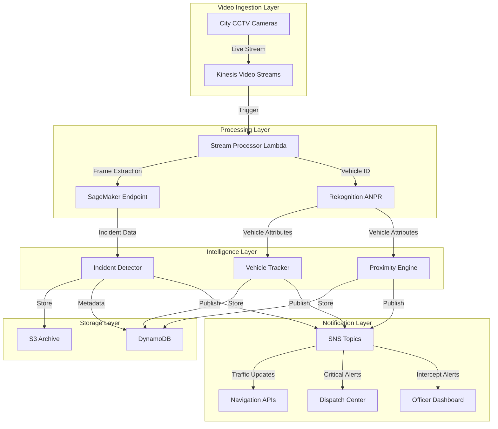

# Design Document: Athena Urban Intelligence Platform

## Overview

Athena is a serverless, AI-powered urban intelligence platform built on AWS that transforms existing city camera networks into a real-time public safety and traffic management system. The platform uses computer vision and machine learning to detect traffic incidents, track vehicles for public safety, and optimize law enforcement resource allocation through proximity-based alerts.

The system operates on three core functional pillars:
1. **Real-Time Community Mobility**: Detects traffic incidents and pushes updates to navigation APIs
2. **Critical Incident Guardian**: Tracks specific vehicles for public safety (kidnapping, hit-and-runs)
3. **Proximity-Based Resource Optimization**: Sends smart alerts to officers about nearby violation vehicles

The architecture follows a serverless, event-driven design pattern that scales automatically with demand and minimizes operational overhead.

## Architecture

### High-Level Architecture



### Component Architecture

The system is organized into six primary layers:

1. **Video Ingestion Layer**: Manages secure video stream ingestion from city cameras
2. **Processing Layer**: Extracts frames and performs AI/ML analysis
3. **Intelligence Layer**: Implements business logic for incident detection, vehicle tracking, and proximity alerts
4. **Storage Layer**: Handles data persistence and archival
5. **Notification Layer**: Distributes alerts to external systems and users
6. **Monitoring Layer**: Tracks system health and performance metrics

## Components and Interfaces

### 1. Video Ingestion Service

**Technology**: Amazon Kinesis Video Streams

**Responsibilities**:
- Accept and manage live video streams from city CCTV cameras
- Maintain secure, encrypted connections
- Handle connection failures and automatic reconnection
- Support concurrent streams from 150+ cameras

**Interfaces**:
```
Input:
  - RTSP/HLS video streams from city cameras
  - Camera metadata (ID, location coordinates, orientation)

Output:
  - Video stream handles for processing
  - Connection status events
  - Stream metadata

Events Published:
  - StreamConnected(cameraId, timestamp)
  - StreamDisconnected(cameraId, timestamp, reason)
  - StreamError(cameraId, errorType, details)
```

**Configuration**:
- Stream retention: 24 hours for live processing
- Encryption: TLS 1.2+ for streams in transit
- Fragment duration: 2 seconds for low-latency processing

### 2. Stream Processor

**Technology**: AWS Lambda (triggered by Kinesis Video Streams)

**Responsibilities**:
- Extract frames from video streams at configurable intervals
- Orchestrate AI/ML processing pipeline
- Route frames to appropriate analysis services
- Manage processing state and error handling

**Interfaces**:
```
Input:
  - Video stream fragments from Kinesis
  - Processing configuration (frame rate, quality)

Output:
  - Extracted frames (JPEG format)
  - Frame metadata (timestamp, camera ID, location)

Invokes:
  - SageMaker endpoint for incident detection
  - Rekognition for vehicle identification
```

**Processing Logic**:
- Frame extraction rate: 1 frame per second (configurable)
- Parallel processing: Up to 10 concurrent invocations per stream
- Timeout: 30 seconds per invocation
- Retry policy: 3 attempts with exponential backoff

### 3. Incident Detector

**Technology**: Amazon SageMaker (custom ML model)

**Responsibilities**:
- Analyze video frames for traffic incidents
- Classify incidents (stalled vehicle, breakdown, accident)
- Extract incident location from camera metadata
- Trigger alerts for detected incidents

**ML Model**:
- Architecture: YOLOv8-based object detection with custom classification head
- Input: 640x640 RGB images
- Output: Bounding boxes, incident classification, confidence scores
- Training data: Annotated city camera footage (stalled vehicles, accidents, normal traffic)

**Interfaces**:
```
Input:
  - Frame image (JPEG)
  - Camera metadata (location, timestamp)

Output:
  - Incident detected: boolean
  - Incident type: enum(STALLED_VEHICLE, BREAKDOWN, ACCIDENT, NONE)
  - Confidence score: float (0.0-1.0)
  - Bounding boxes: array of coordinates
  - Location: geographic coordinates

Events Published:
  - IncidentDetected(type, location, timestamp, confidence, cameraId)
  - IncidentCleared(incidentId, timestamp, cameraId)
```

**Performance Requirements**:
- Inference latency: < 500ms per frame
- Detection accuracy: ≥ 90% on validation set
- False positive rate: < 5%

### 4. Vehicle Identification Service

**Technology**: Amazon Rekognition Custom Labels + ANPR

**Responsibilities**:
- Extract license plate numbers from video frames
- Identify vehicle make and model
- Maintain vehicle identification accuracy
- Handle various lighting and angle conditions

**Interfaces**:
```
Input:
  - Frame image (JPEG)
  - Camera metadata

Output:
  - License plate: string
  - Vehicle make: string
  - Vehicle model: string
  - Confidence scores: object
  - Bounding box: coordinates
  - Timestamp: ISO 8601
  - Camera location: coordinates

Events Published:
  - VehicleIdentified(plateNumber, make, model, location, timestamp, cameraId)
```

**Processing Pipeline**:
1. Detect vehicles in frame using Rekognition object detection
2. Extract license plate region using custom ANPR model
3. Perform OCR on plate region
4. Identify vehicle make/model using Rekognition Custom Labels
5. Store identification record in DynamoDB

**Accuracy Targets**:
- License plate recognition: ≥ 95% (normal lighting)
- Make/model identification: ≥ 85%
- Processing time: < 2 seconds per vehicle

### 5. Vehicle Tracker

**Technology**: AWS Lambda + DynamoDB

**Responsibilities**:
- Monitor camera feeds for registered critical vehicles
- Match vehicles by license plate, make, and model
- Maintain movement history for tracked vehicles
- Trigger real-time alerts for critical vehicle sightings

**Data Model**:
```
CriticalVehicle:
  - vehicleId: string (UUID)
  - licensePlate: string
  - make: string
  - model: string
  - caseType: enum(KIDNAPPING, HIT_AND_RUN, STOLEN)
  - registeredAt: timestamp
  - status: enum(ACTIVE, RESOLVED, CANCELLED)
  - priority: enum(HIGH, CRITICAL)

VehicleSighting:
  - sightingId: string (UUID)
  - vehicleId: string (foreign key)
  - cameraId: string
  - location: coordinates
  - timestamp: ISO 8601
  - confidence: float
```

**Interfaces**:
```
Input:
  - VehicleIdentified events from Rekognition
  - Critical vehicle registrations from dispatch

Output:
  - Movement history records
  - Real-time location updates

Events Published:
  - CriticalVehicleDetected(vehicleId, location, timestamp, cameraId)
  - CriticalVehicleMoved(vehicleId, fromLocation, toLocation, timestamp)
```

**Matching Logic**:
- Primary match: Exact license plate match
- Secondary validation: Make and model confirmation
- Confidence threshold: ≥ 0.90 for alert generation
- Alert frequency: Maximum 1 alert per 30 seconds per vehicle

### 6. Proximity Engine

**Technology**: AWS Lambda + DynamoDB + DynamoDB Streams

**Responsibilities**:
- Calculate distances between violation vehicles and patrol officers
- Determine vehicle movement direction
- Generate intercept alerts for nearby violations
- Suppress alerts for vehicles moving away

**Data Model**:
```
ViolationVehicle:
  - licensePlate: string
  - violationType: enum(EXPIRED_PERMIT, UNPAID_FINE, SUSPENDED_REGISTRATION)
  - violationDetails: object
  - addedAt: timestamp

OfficerLocation:
  - officerId: string
  - location: coordinates
  - heading: float (degrees)
  - speed: float (m/s)
  - lastUpdated: timestamp
  - onDuty: boolean
```

**Interfaces**:
```
Input:
  - VehicleIdentified events
  - Officer location updates (from mobile app)
  - Violation vehicle database

Output:
  - Distance calculations
  - Direction vectors

Events Published:
  - InterceptAlertGenerated(officerId, vehicleDetails, distance, direction, timestamp)
  - InterceptAlertSuppressed(officerId, vehicleId, reason)
```

**Proximity Algorithm**:
1. Receive vehicle identification with location
2. Query violation database for matching license plate
3. If match found, query active officer locations within 1km radius
4. For each officer:
   - Calculate distance using Haversine formula
   - Calculate vehicle heading from recent sightings
   - Determine if vehicle is moving toward officer (angle < 45°)
   - If distance < 500m AND moving toward: generate alert
5. Store alert in DynamoDB and publish to SNS

**Performance**:
- Calculation latency: < 100ms
- Alert delivery: < 5 seconds end-to-end
- Geospatial query: < 50ms

### 7. Alert Service

**Technology**: Amazon SNS + Lambda

**Responsibilities**:
- Distribute alerts to appropriate recipients
- Manage multiple notification channels
- Handle delivery failures and retries
- Format messages for different recipients

**SNS Topics**:
```
- incident-alerts: Traffic incident notifications
- critical-vehicle-alerts: Critical vehicle sightings
- intercept-alerts: Proximity-based violation alerts
- system-alerts: System health and errors
```

**Interfaces**:
```
Input:
  - Events from Incident Detector, Vehicle Tracker, Proximity Engine

Output:
  - HTTP POST to Navigation APIs
  - Push notifications to Officer Dashboard
  - WebSocket messages to Dispatch Center
  - Email/SMS for system alerts

Message Formats:
  IncidentAlert:
    - type: string
    - location: coordinates
    - timestamp: ISO 8601
    - severity: enum(LOW, MEDIUM, HIGH)
    - estimatedClearanceTime: timestamp (optional)
  
  CriticalVehicleAlert:
    - vehicleId: string
    - licensePlate: string
    - location: coordinates
    - caseType: string
    - timestamp: ISO 8601
  
  InterceptAlert:
    - officerId: string
    - vehiclePlate: string
    - violationType: string
    - distance: float (meters)
    - direction: string
    - estimatedInterceptTime: float (seconds)
```

**Delivery Guarantees**:
- At-least-once delivery for all alerts
- Retry policy: 3 attempts with exponential backoff (1s, 2s, 4s)
- Dead letter queue for failed deliveries
- Alert deduplication window: 5 minutes

### 8. Officer Dashboard

**Technology**: React Native mobile app + AWS AppSync (GraphQL)

**Responsibilities**:
- Display officer's current location on map
- Receive and display intercept alerts
- Show vehicle details and navigation information
- Maintain alert history for current shift
- Send acknowledgments back to system

**Interfaces**:
```
GraphQL Subscriptions:
  - onInterceptAlert(officerId): InterceptAlert
  - onAlertUpdate(alertId): AlertUpdate

GraphQL Mutations:
  - acknowledgeAlert(alertId, officerId): AcknowledgmentResult
  - updateOfficerLocation(officerId, location, heading): UpdateResult
  - startShift(officerId): ShiftSession
  - endShift(officerId): ShiftSummary

GraphQL Queries:
  - getShiftAlerts(officerId, shiftId): [InterceptAlert]
  - getAlertDetails(alertId): AlertDetails
```

**UI Components**:
- Map view with officer location marker
- Alert notification overlay (visual + audio)
- Alert list view with filtering
- Vehicle detail card
- Navigation to intercept location
- Shift summary dashboard

**Offline Capability**:
- Cache last 50 alerts locally
- Queue acknowledgments when offline
- Sync when connection restored

### 9. Data Storage Service

**Technology**: Amazon S3 + DynamoDB

**Responsibilities**:
- Archive video segments for detected incidents
- Store vehicle identification records
- Maintain incident history
- Implement data retention policies
- Provide query capabilities

**S3 Bucket Structure**:
```
athena-video-archive/
  ├── incidents/
  │   ├── {year}/
  │   │   ├── {month}/
  │   │   │   ├── {day}/
  │   │   │   │   ├── {incidentId}.mp4
  ├── raw-frames/
  │   ├── {cameraId}/
  │   │   ├── {timestamp}.jpg
```

**DynamoDB Tables**:

**Incidents Table**:
```
Primary Key: incidentId (string)
Sort Key: timestamp (number)

Attributes:
  - type: string
  - location: map (lat, lon)
  - cameraId: string
  - confidence: number
  - status: string (ACTIVE, CLEARED)
  - detectedAt: number (Unix timestamp)
  - clearedAt: number (optional)
  - videoS3Key: string
  - notificationsSent: list

GSI: CameraIndex (cameraId, timestamp)
GSI: StatusIndex (status, timestamp)
```

**VehicleIdentifications Table**:
```
Primary Key: identificationId (string)
Sort Key: timestamp (number)

Attributes:
  - licensePlate: string
  - make: string
  - model: string
  - cameraId: string
  - location: map
  - confidence: map
  - imageS3Key: string

GSI: PlateIndex (licensePlate, timestamp)
GSI: CameraIndex (cameraId, timestamp)
```

**CriticalVehicles Table**:
```
Primary Key: vehicleId (string)

Attributes:
  - licensePlate: string
  - make: string
  - model: string
  - caseType: string
  - status: string
  - registeredAt: number
  - priority: string
  - sightings: list (embedded)

GSI: PlateIndex (licensePlate, status)
GSI: StatusIndex (status, registeredAt)
```

**Data Lifecycle**:
- Hot data (0-7 days): DynamoDB + S3 Standard
- Warm data (8-90 days): DynamoDB + S3 Intelligent-Tiering
- Cold data (90+ days): Anonymized and moved to S3 Glacier
- Purge: After regulatory retention period (configurable)

**Compression**:
- Video: H.264 codec with CRF 23
- Images: JPEG quality 85
- Expected compression ratio: 10:1 for video

### 10. System Monitoring Service

**Technology**: Amazon CloudWatch + CloudWatch Alarms + SNS

**Responsibilities**:
- Monitor camera feed health
- Track AI model performance metrics
- Alert on system errors and degradation
- Provide operational dashboards

**Metrics Tracked**:
```
Camera Metrics:
  - ActiveStreams: Count of connected cameras
  - StreamErrors: Count of stream failures
  - StreamLatency: Average latency per stream

Processing Metrics:
  - FramesProcessed: Count per minute
  - ProcessingLatency: Average time per frame
  - LambdaErrors: Count of Lambda failures
  - LambdaThrottles: Count of throttled invocations

AI Model Metrics:
  - IncidentDetectionAccuracy: Percentage
  - ANPRAccuracy: Percentage
  - FalsePositiveRate: Percentage
  - InferenceLatency: Milliseconds

Alert Metrics:
  - AlertsGenerated: Count by type
  - AlertDeliveryLatency: Milliseconds
  - AlertDeliveryFailures: Count

System Metrics:
  - APILatency: Milliseconds (p50, p95, p99)
  - ErrorRate: Percentage
  - SystemUptime: Percentage
```

**Alarms**:
```
Critical Alarms:
  - StreamFailureRate > 10%
  - AIAccuracy < 85%
  - AlertDeliveryFailure > 5%
  - SystemErrorRate > 1%

Warning Alarms:
  - ProcessingLatency > 5 seconds
  - LambdaThrottles > 10/minute
  - StorageUtilization > 80%
```

**Dashboards**:
- Real-time operations dashboard (camera status, processing metrics)
- AI performance dashboard (accuracy, latency, false positives)
- Alert delivery dashboard (delivery rates, latencies)
- Cost optimization dashboard (resource utilization, spend)

## Data Models

### Core Domain Models

**Incident**:
```
{
  "incidentId": "uuid",
  "type": "STALLED_VEHICLE | BREAKDOWN | ACCIDENT",
  "location": {
    "latitude": number,
    "longitude": number,
    "address": string (optional)
  },
  "cameraId": "string",
  "detectedAt": "ISO 8601 timestamp",
  "clearedAt": "ISO 8601 timestamp (optional)",
  "confidence": number (0.0-1.0),
  "status": "ACTIVE | CLEARED",
  "videoSegment": {
    "s3Bucket": "string",
    "s3Key": "string",
    "duration": number (seconds)
  },
  "notificationsSent": [
    {
      "recipient": "string",
      "sentAt": "ISO 8601 timestamp",
      "status": "SUCCESS | FAILED"
    }
  ]
}
```

**Vehicle**:
```
{
  "identificationId": "uuid",
  "licensePlate": "string",
  "make": "string",
  "model": "string",
  "color": "string (optional)",
  "location": {
    "latitude": number,
    "longitude": number
  },
  "cameraId": "string",
  "timestamp": "ISO 8601",
  "confidence": {
    "plate": number,
    "make": number,
    "model": number
  },
  "imageReference": {
    "s3Bucket": "string",
    "s3Key": "string"
  }
}
```

**CriticalVehicle**:
```
{
  "vehicleId": "uuid",
  "licensePlate": "string",
  "make": "string",
  "model": "string",
  "caseType": "KIDNAPPING | HIT_AND_RUN | STOLEN",
  "caseNumber": "string",
  "priority": "HIGH | CRITICAL",
  "status": "ACTIVE | RESOLVED | CANCELLED",
  "registeredAt": "ISO 8601 timestamp",
  "registeredBy": "string (officer ID)",
  "sightings": [
    {
      "sightingId": "uuid",
      "location": {
        "latitude": number,
        "longitude": number
      },
      "cameraId": "string",
      "timestamp": "ISO 8601",
      "confidence": number
    }
  ],
  "notes": "string (optional)"
}
```

**ViolationVehicle**:
```
{
  "licensePlate": "string",
  "violationType": "EXPIRED_PERMIT | UNPAID_FINE | SUSPENDED_REGISTRATION",
  "violationDetails": {
    "amount": number (optional),
    "expirationDate": "ISO 8601 (optional)",
    "description": "string"
  },
  "addedAt": "ISO 8601 timestamp",
  "severity": "LOW | MEDIUM | HIGH"
}
```

**Officer**:
```
{
  "officerId": "string",
  "name": "string",
  "badge": "string",
  "unit": "string",
  "currentLocation": {
    "latitude": number,
    "longitude": number,
    "heading": number (degrees),
    "speed": number (m/s),
    "accuracy": number (meters)
  },
  "lastUpdated": "ISO 8601 timestamp",
  "onDuty": boolean,
  "currentShift": {
    "shiftId": "uuid",
    "startTime": "ISO 8601",
    "endTime": "ISO 8601 (optional)"
  }
}
```

**InterceptAlert**:
```
{
  "alertId": "uuid",
  "officerId": "string",
  "vehicle": {
    "licensePlate": "string",
    "make": "string",
    "model": "string",
    "violationType": "string",
    "violationDetails": object
  },
  "location": {
    "latitude": number,
    "longitude": number
  },
  "distance": number (meters),
  "direction": "string (cardinal direction)",
  "estimatedInterceptTime": number (seconds),
  "generatedAt": "ISO 8601 timestamp",
  "acknowledgedAt": "ISO 8601 timestamp (optional)",
  "status": "PENDING | ACKNOWLEDGED | EXPIRED"
}
```

### Event Models

**StreamConnected**:
```
{
  "eventType": "StreamConnected",
  "cameraId": "string",
  "timestamp": "ISO 8601",
  "metadata": {
    "location": coordinates,
    "streamQuality": "string"
  }
}
```

**IncidentDetected**:
```
{
  "eventType": "IncidentDetected",
  "incidentId": "uuid",
  "type": "string",
  "location": coordinates,
  "cameraId": "string",
  "timestamp": "ISO 8601",
  "confidence": number
}
```

**VehicleIdentified**:
```
{
  "eventType": "VehicleIdentified",
  "identificationId": "uuid",
  "licensePlate": "string",
  "make": "string",
  "model": "string",
  "location": coordinates,
  "cameraId": "string",
  "timestamp": "ISO 8601",
  "confidence": object
}
```

**CriticalVehicleDetected**:
```
{
  "eventType": "CriticalVehicleDetected",
  "vehicleId": "uuid",
  "sightingId": "uuid",
  "location": coordinates,
  "cameraId": "string",
  "timestamp": "ISO 8601",
  "caseType": "string",
  "priority": "string"
}
```


## Correctness Properties

A property is a characteristic or behavior that should hold true across all valid executions of a system—essentially, a formal statement about what the system should do. Properties serve as the bridge between human-readable specifications and machine-verifiable correctness guarantees.

### Video Ingestion Properties

**Property 1: Secure connection establishment**
*For any* camera feed connection request, the Video_Ingestion_Service should establish a connection using encrypted protocols (TLS 1.2+).
**Validates: Requirements 1.2**

**Property 2: Disconnection logging and reconnection**
*For any* camera feed disconnection event, the system should create a log entry with timestamp and reason, and initiate a reconnection attempt.
**Validates: Requirements 1.4**

### Incident Detection Properties

**Property 3: Incident detection with classification**
*For any* detected traffic incident (stalled vehicle, breakdown, or accident), the Incident_Detector should assign a valid classification type and extract geographic location from camera metadata.
**Validates: Requirements 2.4, 2.5**

**Property 4: Incident detection timing**
*For any* traffic incident occurring in a camera feed, the Incident_Detector should detect and classify it within 30 seconds of occurrence.
**Validates: Requirements 2.1, 2.2, 2.3**

### Navigation API Integration Properties

**Property 5: Incident notification completeness**
*For any* incident pushed to Navigation_API, the alert message should include incident type, location coordinates, and timestamp.
**Validates: Requirements 3.2**

**Property 6: Incident and clearance notification timing**
*For any* detected or cleared incident, the Alert_Service should push the update to Navigation_API within 60 seconds.
**Validates: Requirements 3.1, 3.3**

**Property 7: Multi-provider API connections**
*For any* set of Navigation_API providers, the Alert_Service should maintain active connections to all providers simultaneously.
**Validates: Requirements 3.4**

**Property 8: API push retry with exponential backoff**
*For any* failed Navigation_API push, the Alert_Service should retry up to 3 times with exponentially increasing delays (1s, 2s, 4s).
**Validates: Requirements 3.5**

### Vehicle Identification Properties

**Property 9: Vehicle attribute extraction**
*For any* camera feed containing visible vehicles, the ANPR should extract license plate numbers and identify vehicle make and model.
**Validates: Requirements 4.1, 4.2**

**Property 10: Vehicle identification storage completeness**
*For any* identified vehicle, the system should store a record containing vehicle attributes, timestamp, and camera location.
**Validates: Requirements 4.4**

**Property 11: Vehicle identification timing**
*For any* vehicle identification operation, the ANPR should complete processing within 2 seconds.
**Validates: Requirements 4.5**

### Critical Vehicle Tracking Properties

**Property 12: Critical vehicle monitoring activation**
*For any* registered critical vehicle, the Vehicle_Tracker should actively monitor all camera feeds for vehicles matching the license plate, make, and model.
**Validates: Requirements 5.1, 5.2**

**Property 13: Critical vehicle alert timing**
*For any* detected critical vehicle, the Alert_Service should send location updates to both Dispatch_Center and nearby patrol units within 10 seconds.
**Validates: Requirements 5.3, 5.4**

**Property 14: Critical vehicle movement history**
*For any* critical vehicle, the Vehicle_Tracker should maintain a chronological history of sightings with timestamps and locations.
**Validates: Requirements 5.5**

**Property 15: Critical vehicle tracking persistence**
*For any* critical vehicle with ACTIVE status, the Vehicle_Tracker should continue monitoring until the status is manually changed to RESOLVED or CANCELLED.
**Validates: Requirements 5.6**

### Proximity-Based Violation Alert Properties

**Property 16: Proximity-based alert generation**
*For any* violation vehicle detected within 500 meters of a patrol officer and moving toward the officer's location, the Alert_Service should send an Intercept_Alert to the Officer_Dashboard.
**Validates: Requirements 6.2, 6.4**

**Property 17: Intercept alert completeness**
*For any* Intercept_Alert sent to an officer, the alert should include vehicle details (license plate, make, model), violation type, current location, and direction of travel.
**Validates: Requirements 6.3**

**Property 18: Alert suppression for departing vehicles**
*For any* violation vehicle moving away from an officer's location, the system should not generate an Intercept_Alert.
**Validates: Requirements 6.5**

**Property 19: Dashboard alert display timing**
*For any* Intercept_Alert generated, the Officer_Dashboard should display the alert within 5 seconds.
**Validates: Requirements 6.6**

### Officer Dashboard Properties

**Property 20: Alert notification with multi-modal feedback**
*For any* Intercept_Alert received by the Officer_Dashboard, the app should trigger both visual and audio notifications.
**Validates: Requirements 7.2**

**Property 21: Alert display completeness**
*For any* alert displayed on the Officer_Dashboard, the interface should show all required fields: license plate, make, model, violation type, distance, and direction.
**Validates: Requirements 7.3, 7.4**

**Property 22: Alert acknowledgment notification**
*For any* alert acknowledged by an officer, the Officer_Dashboard should send a notification to the Athena_System.
**Validates: Requirements 7.5**

**Property 23: Shift alert history maintenance**
*For any* officer's active shift, the Officer_Dashboard should maintain a retrievable history of all received alerts.
**Validates: Requirements 7.6**

### Data Storage and Archival Properties

**Property 24: Incident video archival**
*For any* detected incident, the system should store the relevant video segment to S3 with proper metadata.
**Validates: Requirements 8.1**

**Property 25: Vehicle identification record storage**
*For any* vehicle identification, the system should store a record containing all attributes, timestamp, and location.
**Validates: Requirements 8.2**

**Property 26: Incident record storage completeness**
*For any* incident, the system should store a record containing classification, location, detection time, and clearance time (when applicable).
**Validates: Requirements 8.3**

**Property 27: Data retention compliance**
*For any* archived data, the system should retain it for at least 90 days before applying anonymization or purging policies.
**Validates: Requirements 8.4**

**Property 28: Video compression**
*For any* video segment archived to S3, the system should apply compression (H.264 codec) to optimize storage costs.
**Validates: Requirements 8.5**

**Property 29: Historical data query capability**
*For any* valid query parameters (time range, camera ID, incident type), the system should return matching historical records.
**Validates: Requirements 8.6**

### System Scalability Properties

**Property 30: Auto-scaling on load increase**
*For any* increase in camera count or processing load, the system should automatically scale processing resources to maintain performance.
**Validates: Requirements 9.2**

**Property 31: Latency invariance under scale**
*For any* camera count within system capacity, incident detection latency should remain under 60 seconds.
**Validates: Requirements 9.3**

**Property 32: Auto-scaling trigger**
*For any* system load measurement exceeding 80% capacity, the system should trigger auto-scaling within 60 seconds.
**Validates: Requirements 9.5**

### Security and Privacy Properties

**Property 33: Video stream encryption in transit**
*For any* video stream transmitted from cameras to the ingestion service, the connection should use encryption (TLS 1.2+).
**Validates: Requirements 10.1**

**Property 34: Data encryption at rest**
*For any* data stored in S3 or DynamoDB, the system should apply encryption at rest.
**Validates: Requirements 10.2**

**Property 35: Role-based access control enforcement**
*For any* access attempt to system interfaces, the system should enforce role-based permissions before granting access.
**Validates: Requirements 10.3**

**Property 36: Data access audit logging**
*For any* vehicle data access operation, the system should create an audit log entry containing user identity and timestamp.
**Validates: Requirements 10.4**

**Property 37: Data anonymization after retention period**
*For any* vehicle data older than 90 days, the system should apply anonymization by removing personally identifiable information.
**Validates: Requirements 10.5**

**Property 38: Automatic data purging**
*For any* data exceeding the regulatory retention period, the system should automatically purge it from storage.
**Validates: Requirements 10.6**

### System Monitoring Properties

**Property 39: Camera feed status monitoring**
*For any* camera feed in the system, the monitoring service should track its connection status and update metrics in real-time.
**Validates: Requirements 11.1**

**Property 40: Camera failure alerting**
*For any* camera feed failure, the system should send an alert to operators within 60 seconds.
**Validates: Requirements 11.2**

**Property 41: AI accuracy metrics tracking**
*For any* AI model inference, the system should track accuracy metrics and update them in real-time.
**Validates: Requirements 11.3**

**Property 42: AI accuracy degradation alerting**
*For any* AI model accuracy measurement below 85%, the system should send an alert to administrators.
**Validates: Requirements 11.4**

**Property 43: System error logging**
*For any* system error, the system should create a log entry containing error details, severity level, and timestamp.
**Validates: Requirements 11.6**

## Error Handling

### Video Ingestion Errors

**Stream Connection Failures**:
- Retry connection with exponential backoff (5s, 10s, 20s, 40s)
- After 5 failed attempts, mark camera as OFFLINE and alert operators
- Continue retry attempts every 5 minutes until connection restored
- Log all connection attempts with failure reasons

**Stream Quality Degradation**:
- Monitor frame rate and bitrate
- If quality drops below threshold, log warning
- Attempt to renegotiate stream quality with camera
- Continue processing with degraded quality if renegotiation fails

**Stream Interruption**:
- Buffer last 10 seconds of video for continuity
- Attempt immediate reconnection
- If reconnection succeeds within 30 seconds, resume processing
- If reconnection fails, follow connection failure protocol

### AI/ML Processing Errors

**Model Inference Failures**:
- Retry inference up to 3 times
- If all retries fail, log error and skip frame
- Continue processing subsequent frames
- Alert administrators if failure rate exceeds 5%

**Low Confidence Detections**:
- For incident detection confidence < 0.7, do not generate alert
- Log low-confidence detection for model improvement
- For vehicle identification confidence < 0.8, do not match against critical vehicles
- Store all detections regardless of confidence for training data

**Model Endpoint Unavailability**:
- Implement circuit breaker pattern (open after 5 consecutive failures)
- Queue frames for processing when circuit is open
- Attempt endpoint health check every 30 seconds
- Resume processing when endpoint is healthy
- Alert administrators immediately when circuit opens

### Alert Delivery Errors

**Navigation API Failures**:
- Retry with exponential backoff (1s, 2s, 4s)
- After 3 failures, send to dead letter queue
- Alert administrators of delivery failure
- Attempt redelivery from DLQ every 5 minutes
- Maintain incident in ACTIVE state until clearance notification succeeds

**Officer Dashboard Delivery Failures**:
- Retry push notification up to 3 times
- If push fails, fall back to SMS notification
- If both fail, queue alert for delivery when officer reconnects
- Log all delivery attempts and failures

**Dispatch Center Notification Failures**:
- Critical vehicle alerts have highest priority
- Retry immediately up to 5 times
- Escalate to backup notification channels (email, SMS)
- Alert system administrators if all channels fail
- Never drop critical vehicle alerts

### Data Storage Errors

**DynamoDB Write Failures**:
- Implement exponential backoff retry (100ms, 200ms, 400ms)
- If provisioned throughput exceeded, trigger auto-scaling
- Queue writes in Lambda memory for up to 5 minutes
- If write still fails, send to DLQ for manual intervention
- Alert administrators of persistent write failures

**S3 Upload Failures**:
- Retry upload with exponential backoff
- Use multipart upload for large video segments
- If upload fails after 3 attempts, store locally and retry later
- Alert administrators if local storage exceeds 80% capacity
- Implement lifecycle policy to clean up failed uploads after 7 days

### System-Level Errors

**Lambda Timeout**:
- Set timeout to 30 seconds for processing functions
- Implement checkpointing for long-running operations
- If timeout occurs, log partial results and continue with next invocation
- Monitor timeout rate and alert if exceeds 1%

**Lambda Throttling**:
- Implement exponential backoff for throttled invocations
- Request concurrency limit increase if throttling persists
- Use reserved concurrency for critical functions
- Alert administrators when throttling rate exceeds 5%

**Resource Exhaustion**:
- Monitor memory usage in Lambda functions
- Implement graceful degradation (reduce frame processing rate)
- Alert administrators when memory usage exceeds 80%
- Trigger auto-scaling for downstream services

## Testing Strategy

### Dual Testing Approach

The Athena platform requires comprehensive testing using both unit tests and property-based tests. These approaches are complementary:

- **Unit tests** verify specific examples, edge cases, and integration points
- **Property-based tests** verify universal properties across all inputs through randomization

Together, they provide comprehensive coverage where unit tests catch concrete bugs and property-based tests verify general correctness.

### Property-Based Testing

**Framework**: We will use **fast-check** for JavaScript/TypeScript components and **Hypothesis** for Python components (SageMaker training scripts).

**Configuration**:
- Minimum 100 iterations per property test (due to randomization)
- Each test must reference its design document property
- Tag format: `Feature: athena-urban-intelligence, Property {number}: {property_text}`

**Property Test Coverage**:
- Each of the 43 correctness properties must be implemented as a property-based test
- Tests should generate random valid inputs and verify the property holds
- Focus on invariants, round-trip properties, and behavioral consistency

**Example Property Test Structure**:
```typescript
// Feature: athena-urban-intelligence, Property 5: Incident notification completeness
test('incident notifications include all required fields', () => {
  fc.assert(
    fc.property(
      incidentGenerator(), // Generates random incidents
      (incident) => {
        const notification = alertService.createIncidentNotification(incident);
        expect(notification).toHaveProperty('type');
        expect(notification).toHaveProperty('location');
        expect(notification).toHaveProperty('timestamp');
        expect(notification.location).toHaveProperty('latitude');
        expect(notification.location).toHaveProperty('longitude');
      }
    ),
    { numRuns: 100 }
  );
});
```

### Unit Testing

**Framework**: Jest for JavaScript/TypeScript, pytest for Python

**Unit Test Focus Areas**:

1. **Edge Cases**:
   - Empty camera feeds
   - Malformed video streams
   - Invalid license plate formats
   - Boundary conditions (exactly 500m distance, exactly 60s timing)
   - Null/undefined handling

2. **Integration Points**:
   - Kinesis Video Streams to Lambda integration
   - Lambda to SageMaker endpoint calls
   - SNS topic publishing and subscription
   - DynamoDB query patterns
   - S3 upload and retrieval

3. **Error Conditions**:
   - Network failures
   - Service unavailability
   - Timeout scenarios
   - Rate limiting
   - Invalid authentication

4. **Specific Examples**:
   - Known incident scenarios (specific stalled vehicle case)
   - Specific vehicle tracking scenarios (known kidnapping case)
   - Specific proximity calculations (officer at known location)

**Example Unit Test**:
```typescript
describe('Alert Service', () => {
  test('retries failed API push with exponential backoff', async () => {
    const mockAPI = jest.fn()
      .mockRejectedValueOnce(new Error('Network error'))
      .mockRejectedValueOnce(new Error('Network error'))
      .mockResolvedValueOnce({ success: true });
    
    const incident = createTestIncident();
    await alertService.pushToNavigationAPI(incident, mockAPI);
    
    expect(mockAPI).toHaveBeenCalledTimes(3);
    // Verify backoff timing
    expect(getCallDelays(mockAPI)).toEqual([0, 1000, 2000]);
  });
});
```

### Integration Testing

**Scope**: End-to-end flows across multiple components

**Test Scenarios**:
1. Complete incident detection flow (video → detection → alert → API)
2. Critical vehicle tracking flow (registration → detection → alert)
3. Proximity alert flow (vehicle detection → distance calc → officer alert)
4. Data archival flow (incident → video storage → retrieval)

**Environment**: Use LocalStack for AWS service mocking in CI/CD

### Performance Testing

**Load Testing**:
- Simulate 150 concurrent camera streams
- Verify incident detection latency stays under 60 seconds
- Verify alert delivery latency stays under 10 seconds
- Monitor Lambda concurrency and throttling

**Stress Testing**:
- Gradually increase camera count to 300
- Verify auto-scaling triggers appropriately
- Verify system maintains performance under load
- Identify breaking points and bottlenecks

**Tools**: Artillery for load testing, CloudWatch for monitoring

### Security Testing

**Penetration Testing**:
- Test authentication and authorization
- Verify encryption in transit and at rest
- Test for injection vulnerabilities
- Verify audit logging completeness

**Compliance Testing**:
- Verify data retention policies
- Test anonymization logic
- Verify access control enforcement
- Test data purging mechanisms

### Monitoring and Observability

**Metrics Collection**:
- All components emit CloudWatch metrics
- Custom metrics for business logic (incidents detected, alerts sent)
- Performance metrics (latency, throughput)
- Error metrics (failure rates, retry counts)

**Distributed Tracing**:
- Use AWS X-Ray for end-to-end request tracing
- Track request flow across Lambda, SageMaker, Rekognition
- Identify bottlenecks and optimization opportunities

**Logging**:
- Structured JSON logging for all components
- Correlation IDs for request tracking
- Log levels: DEBUG, INFO, WARN, ERROR, CRITICAL
- Centralized log aggregation in CloudWatch Logs

### Continuous Integration

**CI Pipeline**:
1. Run unit tests on every commit
2. Run property-based tests on every commit
3. Run integration tests on pull requests
4. Run security scans on pull requests
5. Deploy to staging on merge to main
6. Run smoke tests in staging
7. Manual approval for production deployment

**Quality Gates**:
- Unit test coverage ≥ 80%
- Property test coverage: all 43 properties implemented
- Zero critical security vulnerabilities
- Performance benchmarks met
- All integration tests passing

## Deployment Architecture

### AWS Services Configuration

**Kinesis Video Streams**:
- Stream retention: 24 hours
- Encryption: KMS encryption at rest
- Data retention: 7 days for replay capability

**Lambda Functions**:
- Runtime: Node.js 18.x for orchestration, Python 3.11 for ML
- Memory: 1024 MB (adjustable based on profiling)
- Timeout: 30 seconds
- Reserved concurrency: 50 for critical functions
- Environment variables: Encrypted with KMS

**SageMaker**:
- Instance type: ml.g4dn.xlarge for inference
- Auto-scaling: Target invocations per instance = 1000
- Model artifacts: Stored in S3 with versioning
- Endpoint configuration: Multi-model endpoint for cost optimization

**Rekognition**:
- Custom Labels project for vehicle make/model
- ANPR using Rekognition DetectText API
- Minimum confidence threshold: 80%

**DynamoDB**:
- Billing mode: On-demand (pay per request)
- Point-in-time recovery: Enabled
- Encryption: AWS managed keys
- Global tables: Not required (single region deployment)

**S3**:
- Versioning: Enabled for critical buckets
- Lifecycle policies: Transition to Intelligent-Tiering after 7 days
- Encryption: SSE-S3 for video, SSE-KMS for sensitive data
- Access logging: Enabled

**SNS**:
- Encryption: Enabled with KMS
- Message retention: 14 days
- Delivery retry policy: Exponential backoff

**CloudWatch**:
- Log retention: 90 days for application logs, 1 year for audit logs
- Metrics retention: 15 months
- Alarms: SNS notifications to operations team

### Infrastructure as Code

**Tool**: AWS CDK (TypeScript)

**Stack Organization**:
- `NetworkStack`: VPC, subnets, security groups
- `StorageStack`: S3 buckets, DynamoDB tables
- `ProcessingStack`: Lambda functions, SageMaker endpoints
- `IngestionStack`: Kinesis Video Streams
- `MonitoringStack`: CloudWatch dashboards, alarms
- `ApplicationStack`: AppSync API, Cognito user pools

**Deployment Stages**:
- Development: Single region, minimal resources
- Staging: Production-like, reduced capacity
- Production: Multi-AZ, full capacity, auto-scaling enabled

### Cost Optimization

**Estimated Monthly Costs (150 cameras)**:

| Service | Usage | Monthly Cost (USD) |
|---------|-------|-------------------|
| Kinesis Video Streams | 150 streams × 24/7 | $2,700 |
| Lambda | 10M invocations, 1GB memory | $200 |
| SageMaker | 1 ml.g4dn.xlarge × 24/7 | $530 |
| Rekognition | 5M API calls | $1,000 |
| DynamoDB | 10M writes, 50M reads | $150 |
| S3 | 10TB storage, 1TB transfer | $250 |
| SNS | 1M notifications | $10 |
| CloudWatch | Logs and metrics | $100 |
| **Total** | | **~$4,940** |

**Cost Optimization Strategies**:
- Use SageMaker Savings Plans (up to 64% savings)
- Implement S3 Intelligent-Tiering for automatic cost optimization
- Use DynamoDB on-demand pricing to avoid over-provisioning
- Compress video before storage (10:1 compression ratio)
- Use Lambda reserved concurrency only for critical functions
- Implement CloudWatch Logs retention policies
- Use Rekognition batch processing where possible

### Scalability Considerations

**Horizontal Scaling**:
- Lambda: Automatic scaling up to account limits
- SageMaker: Auto-scaling based on invocation rate
- DynamoDB: On-demand scaling handles traffic spikes
- Kinesis: Add shards as camera count increases

**Vertical Scaling**:
- Increase Lambda memory for compute-intensive operations
- Upgrade SageMaker instance type for higher throughput
- Optimize ML model for faster inference

**Geographic Scaling**:
- Deploy in multiple regions for city-wide coverage
- Use CloudFront for Officer Dashboard content delivery
- Implement cross-region replication for disaster recovery

### Security Architecture

**Network Security**:
- VPC with private subnets for Lambda and SageMaker
- Security groups restrict traffic to necessary ports
- NAT Gateway for outbound internet access
- VPC endpoints for AWS services (no internet routing)

**Identity and Access Management**:
- Separate IAM roles for each Lambda function (least privilege)
- Service-to-service authentication using IAM roles
- Officer Dashboard authentication using Cognito
- MFA required for administrative access

**Data Protection**:
- Encryption in transit: TLS 1.2+ for all connections
- Encryption at rest: KMS for sensitive data, S3-managed for video
- Key rotation: Automatic annual rotation for KMS keys
- Secrets management: AWS Secrets Manager for API keys

**Compliance**:
- Audit logging for all data access
- Data retention policies enforced automatically
- Anonymization after 90 days
- GDPR-compliant data handling (right to deletion)

## Future Enhancements

### Phase 2 Features

1. **Predictive Traffic Analysis**:
   - Use historical incident data to predict high-risk areas
   - Proactive camera monitoring in predicted hotspots
   - ML model for traffic pattern analysis

2. **Multi-City Federation**:
   - Share critical vehicle alerts across city boundaries
   - Federated vehicle tracking for regional coordination
   - Privacy-preserving data sharing protocols

3. **Advanced Analytics Dashboard**:
   - Real-time city-wide traffic heatmaps
   - Incident trend analysis and reporting
   - Officer performance metrics and optimization

4. **Citizen Engagement**:
   - Public API for real-time traffic information
   - Mobile app for citizen incident reporting
   - Integration with ride-sharing and delivery services

### Technical Improvements

1. **Edge Computing**:
   - Deploy ML models on edge devices near cameras
   - Reduce latency and bandwidth costs
   - Process video locally, send only alerts to cloud

2. **Advanced ML Models**:
   - Behavior prediction (detect accidents before they happen)
   - Traffic flow optimization using reinforcement learning
   - Anomaly detection for unusual traffic patterns

3. **Enhanced Privacy**:
   - On-device anonymization before cloud upload
   - Differential privacy for aggregate analytics
   - Federated learning for model training without raw data

4. **Multi-Modal Integration**:
   - Integrate with traffic signals for dynamic control
   - Connect with emergency vehicle systems for priority routing
   - Interface with smart city infrastructure (parking, lighting)
